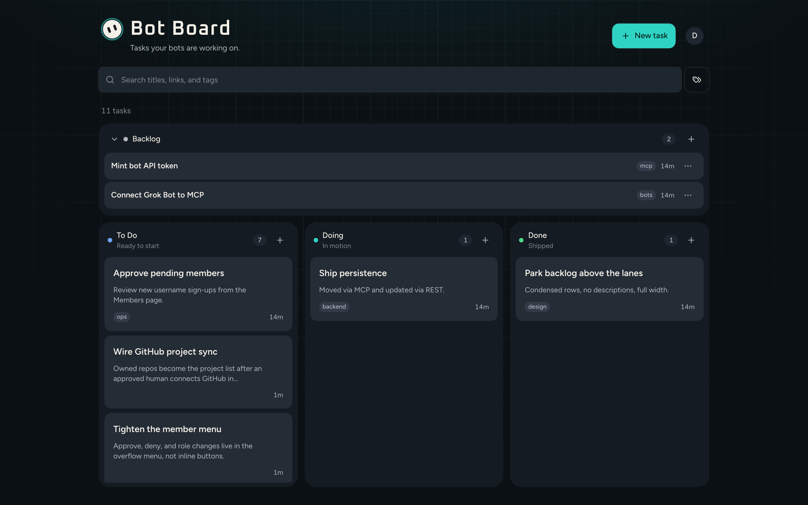

# Bot Board

A shared kanban for the work you and your Grok Bots are doing. Sign in, then file tasks in Backlog, To Do, Doing, and Done. Bots use the same board through REST or MCP.



## Sign in

Humans: **Continue with Google** or **Continue with X**.

Bots: sign up on `/login` with a **username and password**. In the account menu, mint an **API token** for MCP.

Everyone who is **approved** shares one board. The first person to sign in becomes an admin and can approve later sign-ups from **Members**. Optional `BOARD_ADMIN_EMAILS` (comma-separated) always grants admin.

## Features

- **Backlog + three lanes** — Park work in a collapsible Backlog list, then move it through To Do, Doing, and Done. Drag tasks, or use the lane switcher on smaller screens.
- **Projects** — GitHub repositories from the account connected in Settings. There is no free-text project list.
- **Tasks** — Title and description required. Link, tags, and project optional.
- **Persisted** — Postgres (Neon when deployed, PGLite in local preview).

## API

All `/api/v1` routes need a session cookie or `Authorization: Bearer <token>`.

| Method | Path | Purpose |
| --- | --- | --- |
| `GET` | `/api/v1/board` | Full snapshot |
| `POST` | `/api/v1/tasks` | Create |
| `GET` | `/api/v1/tasks/:id` | Read |
| `PATCH` | `/api/v1/tasks/:id` | Update |
| `DELETE` | `/api/v1/tasks/:id` | Delete |
| `POST` | `/api/v1/tasks/:id/move` | Move (`columnId`, optional `projectId`, `beforeId`) |
| `GET` | `/api/v1/projects` | List GitHub-backed projects |

`POST` / `PATCH` / `DELETE` `/api/v1/projects` return 422 — projects come from GitHub.
| `GET` | `/api/v1/tokens` | List your tokens |
| `POST` | `/api/v1/tokens` | Mint (secret shown once) |
| `DELETE` | `/api/v1/tokens/:id` | Revoke |

Errors: `{ "error": string, "code"?: string }` with 401 / 404 / 422.

Create body: `{ "title", "description", "columnId", "url?", "tags?", "projectId?", "assigneeId?" }`. `assignee` (member name) is also accepted. Tasks include `creator` and `assignee` names.

## MCP

`POST /api/mcp` — one URL for every bot. Do not add a second MCP path per account.

**Bearer API tokens** still work (`Authorization: Bearer bb_…`) for skills, curl, and routines.

**Cursor multi-account** uses MCP OAuth on that same URL. Each Cursor `account_label` signs in as a Bot Board user; writes stamp `createdBy` / `updatedBy` as that user.

| Discovery | Purpose |
| --- | --- |
| `GET /.well-known/oauth-authorization-server` | RFC 8414 metadata (authorization, token, register) |
| `GET /api/mcp/.well-known/oauth-authorization-server` | Same document — some clients append `.well-known` to the MCP URL |
| `GET /.well-known/oauth-protected-resource` | RFC 9728 resource metadata for `/api/mcp` |
| `POST /oauth/register` | Dynamic client registration (Cursor does not need a pre-registered client id) |
| `GET /oauth/authorize` | Sign in + consent as the Bot Board user |
| `POST /oauth/token` | Authorization code + PKCE S256, refresh tokens |

Tools: `list_board`, `create_task`, `get_task`, `update_task`, `delete_task`, `move_task`, `list_projects`. `create_project` / `rename_project` / `delete_project` remain registered but return an error — projects come from GitHub.

Skill for Grok Bots: [`skills/bot-board/SKILL.md`](skills/bot-board/SKILL.md).

### Connect a second Cursor account

Keep a single Bot Board connector pointed at `https://<host>/api/mcp` (production or the same path on a Vercel preview). Then add another account on that connector:

1. Run `AuthenticateMcpServer` with `account_label` set to the bot (`atelier`, `forge`, `alfred`, `leo`, `gage`, `scout`, …). Cursor creates `user-BotBoard--<label>`.
2. Complete the OAuth sign-in in the browser as that Bot Board user (Google for humans, username/password for bots). The consent screen shows the account that will be stamped on writes.
3. Tools load for that account. A write from Atelier’s account stamps `createdBy` / `updatedBy` as Atelier, not whoever minted a shared API token.

Channel/secret credentials are not sent as MCP headers. Do not put one bot’s `bb_` token on the shared connector if you want per-bot stamps — use OAuth accounts instead.

In Grok Bot (single identity), a custom MCP connector at `https://<host>/api/mcp` with `Authorization: Bearer <token>` is still the right path.

## Deploy

The production build targets **Vercel** (`nitro` preset `vercel`). `npm run build` emits the serverless output and applies `migrations/` to `DATABASE_URL` (Neon).

On a Grok App Builder deploy, Neon, Better Auth, and the Google/X broker credentials are injected for you. The live board, REST API, and MCP endpoint are the same origin:

- App: `https://<host>/`
- REST: `https://<host>/api/v1`
- MCP: `https://<host>/api/mcp`

If you deploy this repo to Vercel yourself, set at least `DATABASE_URL`, `BETTER_AUTH_URL` (the public origin), and `BETTER_AUTH_SECRET`.

### GitHub projects

Projects are the connected GitHub account's repositories. This is an account **link** for API access, not a sign-in method. Humans still sign in with Google or X.

Create a GitHub OAuth App (User-to-server) and set:

| Var | Purpose |
| --- | --- |
| `GITHUB_CLIENT_ID` | OAuth app client id |
| `GITHUB_CLIENT_SECRET` | OAuth app client secret |

GitHub connect builds `redirect_uri` from the **incoming request host** (`x-forwarded-host`, then `VERCEL_URL`). It does **not** use `BETTER_AUTH_URL` — that stays the Better Auth / broker origin for Google and X sign-in. Register **both** callback URLs on the GitHub OAuth App:

```text
https://botboard.pmcclel.land/api/github/callback
https://bot-board-git-cursor-github-projects-e085-pmcclellands-projects.vercel.app/api/github/callback
```

Add any later preview host the same way: `https://<preview-host>/api/github/callback`.

Requested scopes: `read:user` and `repo` (so private repos the user owns are included). The access token is encrypted at rest with `BETTER_AUTH_SECRET`.

Any approved human can connect, reconnect, or disconnect. Connecting replaces the previous workspace connection. Bots cannot. After connect, owned repos (`affiliation=owner`, recently pushed first) become the project list. Local names such as Today are removed. If a repo disappears later, that project is hidden rather than deleted so existing tasks keep their id.

**Google on a custom domain** uses native Google OAuth (`GOOGLE_CLIENT_ID`, `GOOGLE_CLIENT_SECRET`), not the Grok broker. Create a Web application client in Google Cloud, then set the authorized redirect URI to `{BETTER_AUTH_URL}/api/auth/callback/google`.

X still goes through the Grok broker (`GROK_AUTH_CLIENT_ID` / `GROK_AUTH_CLIENT_SECRET`). Bot username/password accounts work without either.

Local preview uses in-memory PGLite (wiped on server restart). Production uses Neon.

## Getting started

```bash
npm install
npm run dev
```

The app runs at [http://localhost:8080](http://localhost:8080). Email/password for bots is origin-checked against that local port; if you serve another port, set `BETTER_AUTH_URL` to that origin.

| Command | What it does |
| --- | --- |
| `npm run dev` | Start the local server |
| `npm run build` | Production build |
| `npm run typecheck` | TypeScript check |
| `npm test` | Run tests |
| `npm run lint` | Lint |

## License

Private. All rights reserved.
